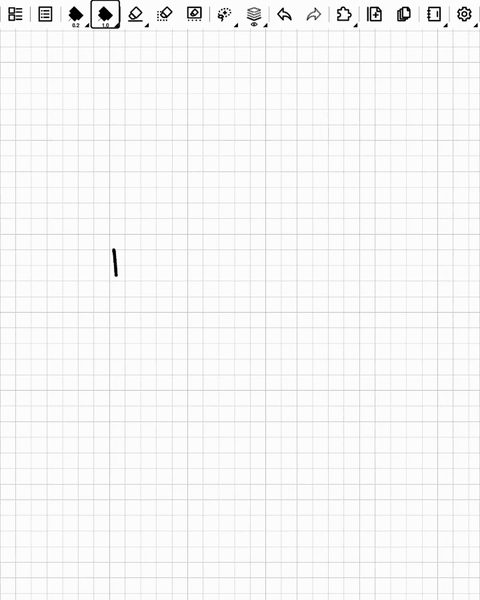

# Snap — Supernote plugin

<p align="center">
  
  <br>
  <sub><a href="docs/snap-demo.mp4">Full-quality video (MP4)</a></sub>
</p>

Formerly **ShapeSnap**.

Draw a **rectangle**, a **circle**, an **arrow**, a **curly brace**, a **square root** or **coordinate axes** and hold the pen still for a moment (350 ms by default). The stroke is replaced by a perfect shape:

- **Pen style:** it uses the active pen (type, color, width).
- **Resizing:** the shape appears lasso-selected, ready to be resized (in notes; not axes, made of several pieces, and not in PDFs, see below).
- **Circles:** always perfect, even from a slightly oval stroke. Ellipses are never created.
- **Rectangles:** strokes tilted less than 8° (setting) are snapped to the page axes. Beyond that, the rectangle keeps its tilt. Long, thin rectangles are recognised too.
- **Tiny shapes:** circles and rectangles down to about 1 mm, but only after a 300 ms pause at the end (under about 5 mm), so that an "o" or a "0" written at speed stays ink.
- **Arrows:** draw a straight line, then its head at the end, without lifting the pen (a triangle, a V, or barb → tip → barb). The result is a clean shaft with a solid triangular head whose size depends only on the pen width, never on the drawn head. A shaft within the **Arrow snapping** angle (default 8°) of horizontal or vertical is snapped to it; otherwise it keeps its direction.
- **Curly braces:** `{`, `}`, over- or under-braces, in one stroke. The clean brace keeps the drawn length and depth, and is straightened when within 12° of the page axes.
- **Square roots:** a √ drawn upright in one stroke (short entry, long rise, bar to the right). The bar keeps the drawn length, so it covers what is written under it, however tall.
- **Coordinate axes:** draw an "L" (two legs at a right angle, each at least 90 px), at any angle. The corner becomes the origin; each leg becomes an axis in the direction it was drawn, with ticks (every 5 mm by default, drawn as a separate, thinner polyline) and a solid arrow head. Within 8° (setting) of the page axes, they are straightened.
- **Normal writing:** a stroke without a pause is left untouched.

Its settings open from the plugin menu (the **Snap** button in the side bar) or under **Settings → Apps → Plugins → Snap**.

## Settings

One page, no scrolling. The **On / Off** switch in the header turns Snap off altogether. Then one row per shape (circle, rectangle, arrow, axes, brace, square root): tap its icon to turn it on (black) or off (grey); its settings sit next to it.

| Shape | Settings |
|---|---|
| Rectangle | **Straighten**: tilted less than this, it is set square to the page (0–20°, default 8°) |
| Circle, brace, square root | — |
| Arrow | **Straighten** (0–20°, default 8°) · **Head**: head size, % of the size set by the pen width (30–200 %, default 100 %) |
| Axes | **Straighten** (0–20°, default 8°) · **Head** (as for arrows) · **Ticks**: On or Off · **Tick width**: % of the axis line width (20–100 %, default 50 %) · **Tick every**: spacing in mm (2–20, default 5) |

**Detection**, on one row: **Hold** (pause required at the end of the stroke, 0–1000 ms, default 350; 0 snaps as soon as the pen lifts), **Stillness** (jitter allowed during the hold, default 12 px), **Tolerance** (1 strict to 5 lenient, default 5).

All settings are saved and survive restarts and updates (one small folder per setting in the plugin directory: the SDK cannot write text files). A **Last stroke** line at the bottom tells what happened to the last stroke.

## How it works

- **Hold detection:**
  - Main method: pen motion events (`registerMotionListener`), which carry timestamps.
  - Fallback: count the still points at the end of the stroke.
- **Recognition** (`src/recognize.ts`, unit-tested with simulated hand-drawn shapes):
  - The stroke is resampled, and any overshoot past the starting point is cut off.
  - Sharp corners are counted along the loop.
  - A circle (least squares) and a minimum-area rectangle are fitted to the loop.
  - It is a rectangle if there are about 4 corners and a small rectangle error. It is a circle if there are no corners and a small circle error.
  - Otherwise, open shapes are tried in turn (`src/symbols.ts` for the maths ones):
    - brace: the stroke bulges to one side of its start → end chord (depth 6–40% of its length) and has a sharp feature in the middle (40–60% of the length) with smooth arms: a textbook point, a notch between two "(" arcs, or the vertex of a quick "<". An arc "(" (no sharp middle), an "S" (both sides) and a "W" (sharp arms) are rejected;
    - square root: the lowest point, then a straight rise at 45–105° up to the corner (the point farthest from the bottom → end line), then a roughly horizontal bar to the right; before the lowest point, a short entry of any shape ("‾|", hooked, straight) staying left of it and below the bar. A check mark has no bar and is rejected. The clean radical has textbook proportions, its bar horizontal at the corner height;
    - axes: two straight legs at a right angle, within 7° of the page axes (tried before the brace and the square root, which also have a sharp middle);
  - an arrow: the tip is the first point farthest from the start; the start → tip shaft must be straight (slight bowing allowed); what is drawn after the tip must be small, go back behind the tip and reach both sides of the shaft. The whole arrow is one polyline (`GEO_polygon`), 30° barbs, length `24 px + 3.2 px per pen pixel` (0.5 pen: 43 px). Geometries cannot be filled, so the polyline zigzags across the head with rungs closer than the line width, which merge into a solid head.
- **Replacement:** the hand-drawn stroke is deleted by element number (`deletePageElements`), even when drawn over writing or other shapes; only the stroke that matches (ink pen, same first and last point) is ever deleted. Then the shape is inserted with `insertGeometry`; if that fails, the stroke is put back. Measured on a Manta (3.29 beta): `deletePageElements` clears Supernote's undo history, while `insertGeometry` and lasso operations keep it.
- **Writing goes on:** the page is never changed while the pen is writing the next stroke (the host dropped that stroke): Snap waits for the pen to lift. The new shape is not lasso-selected if writing has resumed, since the selection would take the next stroke as a lasso gesture.
- **Redraw:** without a lasso selection, the host does not redraw the area, and the deleted stroke kept showing wherever the pen passed for a few seconds. After axes (or any shape inserted without a lasso), Snap saves the note and reloads it, which redraws the page.
- **PDFs:** there the lasso put on a new shape misled the lasso APIs (Palette read the shape at the wrong place), so shapes are never selected. There is no save for PDFs in the SDK, so no reload either: Snap opens and closes an empty, transparent plugin view for a quarter of a second, which makes the host redraw the page under it.
- If the file or page changes while a stroke is being processed, the plugin cancels without editing anything.
- **Lasso tool:** the host sends lasso paths through the same pen-up event, as a stroke with `penType` 4 (measured on a Manta, undocumented). While the lasso tool is active, the lasso APIs (`getLassoRect`…) answer "not allowed" (code 102), so they cannot detect it. Snap therefore only touches strokes drawn with a known ink pen (`penType` 1, 10, 11, 15 from the SDK, and 16 for the ink pen, measured; `src/guard.ts`); anything else is ignored. As a second guard, a stroke is also ignored when a lasso selection exists when the pen lifts. The plugin never drives the lasso itself.
- **Point sources:** points are read in page pixels, then as raw pen (EMR) coordinates, which do not depend on the reported page size (zoom, landscape).
- **Timeout:** each stroke is processed within 8 s, so a stuck host call can never block the following strokes.
- **Arrow heads** are 70 % of the former size at the default 100 % head setting.

## Install and build

1. Download `Snap.snplg` from the [latest release](https://github.com/CharlesCheval/supernote-snap/releases/latest) and copy it to the device's `MyStyle` folder (USB, Supernote Partner or Browse & Access).
2. Open **Settings → Apps → Plugins → Add plugin**. It replaces ShapeSnap in place, settings included.
3. The first snapped shape asks for file access (**Always allow**), needed to delete the hand-drawn stroke.

To build from source:

```bash
npm install
npm run build   # -> build/outputs/ShapeSnap.snplg (the plugin key stays ShapeSnap)
npx jest
```

## Releasing

Bump `versionName` **and** `versionCode` in `PluginConfig.json` (the device only upgrades when `versionCode` increases), commit, then push a matching tag:

```bash
git tag v<versionName>
git push origin v<versionName>
```

GitHub Actions runs the tests, builds the plugin and attaches it to the release as `Snap.snplg`.

## License

[MIT](LICENSE) © Charles Cheval. Not affiliated with Ratta / Supernote.
